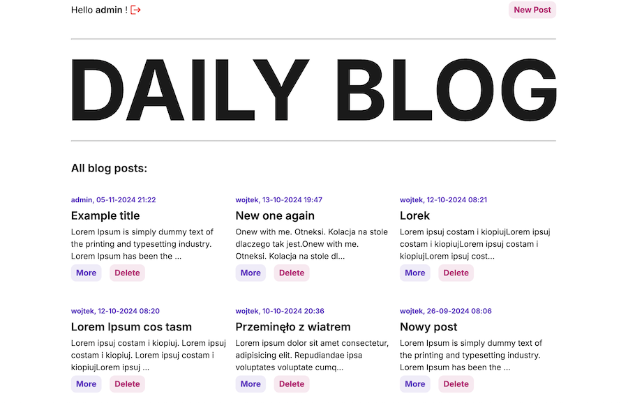
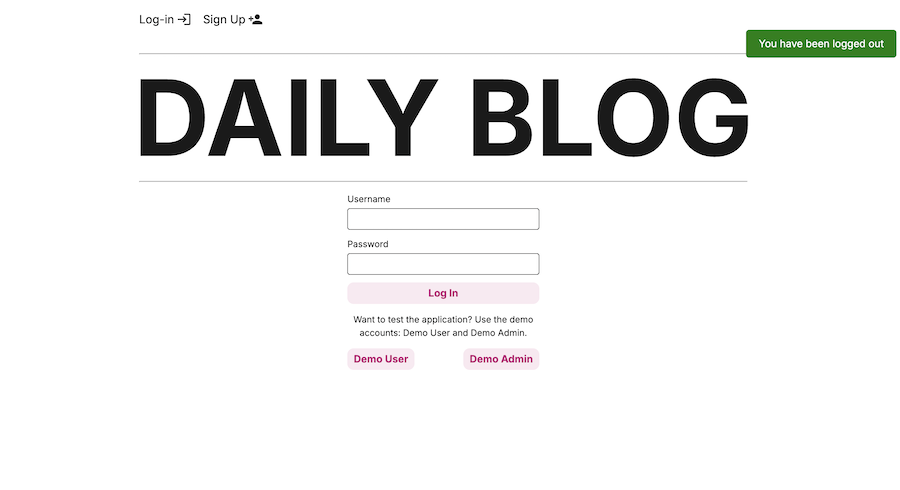
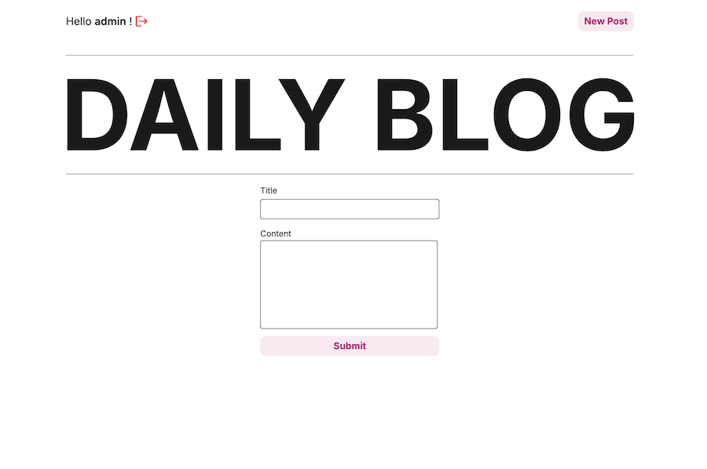

# 📚 Odin Project Blog API

[](https://my-blog-api.netlify.app/)  
[](https://github.com/BigWojtek7/odin-express-blog-api)

A blog application built as part of [The Odin Project](https://www.theodinproject.com/) curriculum. This web app allows users to view posts and, if logged in, comment on them. Admin users have additional permissions to add , delete posts and delete comments.

## 🚀 Features

- **View Posts**: Browse blog posts without logging in.
  
- **Comment**: Log in to leave comments on posts.
  
- **Admin Permissions**: As an admin, you can add and delete posts and delete comments.
  
- **Post details**: You can browse posts without login (just click the 'More' button.)
  

## 🌐 Live Demo

Check out the live version: [Live Preview](https://my-blog-api.netlify.app/)

## 📂 Project Structure

```plaintext
📦 odin-project-blog-api
├── 📁 public                # Static files
├── 📁 src
│   ├── 📁 components        # React components
│   ├── 📁 contexts          # Context API for global state
│   ├── 📁 hooks             # Custom hooks
│   ├── 📁 pages             # Main pages (e.g., Home, Login)
│   ├── 📁 services          # API calls
│   └── App.js               # Main app component
├── README.md                # Project documentation
└── package.json             # Project dependencies
```

## ⚙️ Installation and Setup

1. **Clone the repository:**

   ```bash
   git clone https://github.com/BigWojtek7/odin-express-blog-api.git
   ```

2. **Navigate to the project folder:**

   ```bash
   cd odin-express-blog-api
   ```

3. **Install dependencies:**

   ```bash
   npm install
   ```

4. **Run the development server:**
   ```bash
   npm start
   ```

## 🧑‍💻 User Accounts

### Admin Account

To test admin functionalities, log in with the following account:

<details>
<summary>Show credentials</summary>

- **Username**: `admin`
- **Password**: `admin`

</details>

### Regular User Account

You can create a regular user account in the app, or use the example account:

<details>
<summary>Show credentials</summary>

- **Username**: `user`
- **Password**: `user`

</details>

## 🛠 Tech Stack

- **Frontend**: React
- **Backend**: Express
- **Database**: PostGreSQL
- **Authentication**: JSON Web Token (JWT)
- **Styling**: CSS Modules

## 📜 License

This project is licensed under the MIT License. See the [LICENSE](LICENSE) file for details.
